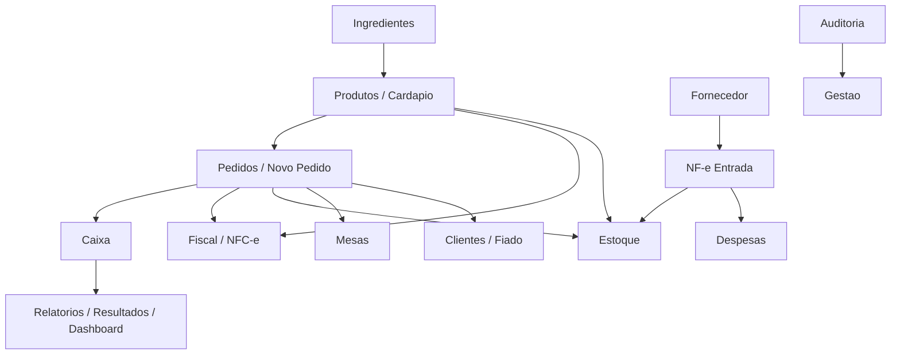

# Dossie dos Modulos do Sistema

Este documento organiza os modulos funcionais do sistema com base nos nomes informados e nas rotas/rotinas encontradas no backend Delphi/Horse.

## Base Tecnica Observada

O backend esta dividido principalmente em:

- `src/util/util.pas`: API v1, rotinas legadas de pedido, caixa, mesas, produtos, estoque, impressao, dashboard e utilitarios.
- `src/modulos/v2/v2.pas`: API v2, rotinas administrativas, gestao, dashboard, relatorios, clientes, fiado, despesas, produtos, estoque, cardapio e parametros.
- `src/modulos/nfce/nfce.pas`: endpoints fiscais, NFC-e, DF-e, notas emitidas, sincronizacao contabilidade e envio de XML/e-mail.
- `uNFCe.pas`: regra de negocio fiscal, emissao NFC-e, consulta DF-e, importacao XML, status de servico NFe, fila de emissao e registros de erro.
- `src/controller/uControlerProdutoNotaFiscal.pas`: fornecedor, itens de nota, validacao de despesa e entrada de estoque por nota fiscal.

## Mapa Geral

| Area | Modulos de tela | Responsabilidade principal | Backend principal |
| --- | --- | --- | --- |
| Atendimento | Pedidos, Novo Pedido, Venda Direta | Criacao, alteracao, finalizacao e consulta de pedidos | `util.pas`, `v2.pas`, `PedidoSite.pas`, `PedidoController.pas` |
| Salao | Mesas | Controle de mesas, comandas, transferencia e consumo | `util.pas`, `v2.pas` |
| Financeiro | Caixa, Relatorio, Relatorio de Vendas, Resultados, Dashboard | Caixa, faturamento, recebimentos, metricas e indicadores | `util.pas`, `v2.pas` |
| Gestao | Gestao, Despesas, Fiado, Auditoria, Horario | Cadastros operacionais, contas, credito de cliente, logs e parametros | `v2.pas` |
| Fiscal | Fiscal, Emitidas, DF-e, NF-e Entrada | Emissao/consulta fiscal, importacao XML e documentos fiscais | `nfce.pas`, `uNFCe.pas`, `uControlerProdutoNotaFiscal.pas` |
| Compras | Fornecedor | Cadastro de fornecedor e vinculacao de itens fiscais | `uControlerProdutoNotaFiscal.pas` |
| Cardapio | Produtos, Cardapio, Menu, Cadastro Fiscal | Produtos, categorias, adicionais, sabores, disponibilidade e dados fiscais | `util.pas`, `v2.pas`, `uControlerProdutoNotaFiscal.pas` |
| Estoque | Estoque, Ingredientes | Movimentacao, baixa, recontagem, insumos e CMV | `util.pas`, `v2.pas`, `uControlerProdutoNotaFiscal.pas` |

## Atendimento

### Pedidos

**Objetivo:** concentrar a consulta e operacao de pedidos ja criados, incluindo status, impressao, pagamento, motoboy, dados do cliente e itens.

**Recursos identificados no backend:**

- Consulta de pedidos por periodo, horario, tipo e faturamento.
- Consulta de dados completos do pedido.
- Consulta de produtos do pedido.
- Alteracao de status do pedido.
- Reimpressao.
- Extorno.
- Atualizacao de dados de pedido.
- Pedido de site/delivery.
- Pedido de motoboy.
- Cancelamento.

**Rotas relacionadas:**

- `GET /v1/pedidos/:dataini/:datafim/:horaini/:horafim/:tipo/:faturado`
- `GET /v1/dados/pedido/:codigo`
- `GET /v1/pedido/produtos/:pedido`
- `PUT /v1/pedido/status/:pedido/:status/`
- `POST /v1/pedido/reimpressao/app/:id`
- `POST /v1/util/pedido/caixa/extorno/:id`
- `POST /v1/atualiza/dados/pedido/`
- `GET /v2/dados/pedido/:pedido`
- `GET /v2/dados/pedido/impressao/:pedido`
- `POST /v2/cancelar/pedido`
- `POST /v2/aceita/pedido`
- `GET /v2/pedidos/motoboy/:codigo`
- `POST /v2/pedidos/motoboy`

**Tabelas mais envolvidas:**

- `pedido`
- `pedido_produtos`
- `pedido_produto_sap`
- `pedido_status`
- `cliente`
- `cliente_endereco`
- `caixa_movimento`
- `caixa_receber`
- `impressao_pedido`
- `impressao_pedido_produto`

### Novo Pedido

**Objetivo:** fluxo de abertura/criacao de pedido, seja mesa, delivery, retirada, site ou app.

**Recursos identificados:**

- Geracao de codigo de pedido.
- Geracao de codigo diario.
- Insercao de pedido.
- Insercao de produtos.
- Inclusao de adicionais/sabores.
- Vinculo com mesa quando aplicavel.
- Atualizacao de totais.

**Rotas relacionadas:**

- `GET /v1/codigo/pedido`
- `GET /v1/codigo/pedido/:mesa`
- `GET /v1/codigo/pedido/dia`
- `POST /v1/pedido/produto/:usuario`
- `POST /v1/delete/pedido/produto/:id`
- `POST /v2/site/grava/pedido`
- `POST /v2/grava/varios/produtos`
- `POST /v2/pedido/produtos/seleciona/:codigo/:selecionado`

**Observacoes tecnicas:**

- O backend possui mais de um fluxo de criacao de pedido: API v1, v2, site e iFood.
- Existem rotinas que abrem pedido com `status = -1` para consumo em andamento e depois finalizam/faturam.

### Venda Direta

**Objetivo:** venda rapida sem fluxo longo de mesa/delivery, normalmente ligada ao caixa/PDV.

**Recursos identificados:**

- Criacao de pedido com origem de PDV.
- Atualizacao de cliente/endereco quando necessario.
- Finalizacao com pagamento.
- Lancamento em caixa.

**Rotas relacionadas:**

- `POST /v1/atualiza/dados/pedido/`
- `POST /v1/caixa/fechamento/pedido/automatico/:caixa`
- `POST /v1/fechamento/pedido/automatico/:pedido/:caixa`
- `POST /v1/caixa/recebimento/pedido/:caixa/:id/:pedido`
- `POST /v2/entrada/pagamento/fiado`

## Salao

### Mesas

**Objetivo:** controle de mesas/comandas, consumo, transferencia, abertura e encerramento.

**Recursos identificados:**

- Listagem de mesas.
- Criacao de mesas.
- Zerar/deletar mesa.
- Transferencia de mesa/produtos.
- Comanda por codigo ou id.
- Descricao de comanda.
- Ocupacao/dashboard de mesas.

**Rotas relacionadas:**

- `GET /v1/mesas/all/`
- `POST /v1/util/grava/mesa/:tipo/:min/:max`
- `POST /v1/mesa/zera/:id`
- `POST /v1/mesa/deleta/:id`
- `POST /v1/transferencia/mesa/:id/:mesa`
- `GET /v1/util/dashboard/ocupacao`
- `GET /v2/comanda/:codigo`
- `GET /v2/comanda/id/:id`
- `POST /v2/comanda/:codigo/:mesa`
- `POST /v2/comanda/descricao/:codigo/:mesa`
- `POST /v2/transferencia/produtos/:pedido`
- `POST /v2/grava/mesa`
- `POST /v2/delete/mesa/:id`

**Tabelas mais envolvidas:**

- `mesa`
- `mesa_tipo`
- `pedido`
- `pedido_produtos`

## Financeiro e Indicadores

### Caixa

**Objetivo:** abertura, movimentacao, recebimento, fechamento e historico de caixa.

**Recursos identificados:**

- Caixa aberto por usuario.
- Abertura de caixa.
- Sangria.
- Movimentacao manual.
- Dados do caixa.
- Pedidos do caixa.
- Historico.
- Pagamentos.
- Resumo.
- Recebimento de pedido.
- Validacao de fechamento.

**Rotas relacionadas:**

- `GET /v1/caixa/aberto/:usuario`
- `POST /v1/caixa/abertura/:usuario/:valor`
- `POST /v1/caixa/sangria`
- `POST /v1/caixa/movimentacao/`
- `GET /v1/caixa/dados/:caixa`
- `GET /v1/caixa/pedidos/dados/:caixa`
- `GET /v1/caixa/pedidos/historico/:caixa`
- `GET /v1/caixa/pedidos/pagamento/:caixa`
- `GET /v1/caixa/resumo`
- `GET /v1/caixa/historico/`
- `GET /v1/caixa/historico/ultimos/7/dias`
- `GET /v1/caixa/receber/:codigo`
- `POST /v1/caixa/fechamento/:caixa`
- `GET /v2/valida/fechamento/caixa/:usuario`
- `GET /v2/forma/pagamento/caixa/:id`
- `GET /v2/sangria/caixa/:id`
- `GET /v2/movimentacoes/caixa/:codigo`
- `POST /v2/caixa/deleta/sangria/:codigo`
- `POST /v2/caixa/imprime/sangria/:codigo`

**Tabelas mais envolvidas:**

- `caixa`
- `caixa_movimento`
- `caixa_receber`
- `tipo_pagamento`
- `pedido`

### Relatorio

**Objetivo:** relatorios operacionais e financeiros.

**Recursos identificados:**

- Total por periodo/hora.
- Total por motoboy.
- Relatorio financeiro.
- Relatorio de produtos.
- Relatorio de vendas.
- Media de pedidos.

**Rotas relacionadas:**

- `GET /v1/total/:dataini/:datafim/:horaini/:horafim`
- `GET /v1/total/motoboy/:dataini/:datafim/:horaini/:horafim`
- `GET /v1/relatorio/venda/:dataini/:datafim`
- `POST /v2/relatorio/produtos/periodo`
- `GET /v1/media/pedido`
- `POST /v1/media/pedido`

### Relatorio de Vendas

**Objetivo:** visao consolidada das vendas por periodo, canal e indicadores comerciais.

**Recursos identificados:**

- Busca de vendas por periodo.
- Dashboard de venda com cache.
- Consolidacao por pedidos atuais e tabelas historicas.

**Rotas relacionadas:**

- `GET /v2/dashboard/venda/:dataini/:datafim`
- `POST /v2/dashboard/venda/:dataini/:datafim`
- `GET /v1/relatorio/venda/:dataini/:datafim`

**Observacoes tecnicas:**

- `v2.pas` possui camada de cache para dashboard de vendas.
- Ha logica para consultar tabela `pedido` atual e tabelas particionadas/historicas `pedido_yyyy_mm`.

### Resultados

**Objetivo:** metricas executivas e resultados do negocio.

**Recursos identificados:**

- Indicadores agregados.
- Metricas de resultado.
- Fechamento fiado.
- Movimentacao de pagamentos.
- Pedidos cancelados.

**Rotas relacionadas:**

- `GET /v2/resultado/metricas`
- `GET /v2/fechamento/fiado`
- `GET /v2/movimentacao/pagamento`
- `GET /v2/pedido/cancelado`

### Dashboard

**Objetivo:** painel principal de operacao e gestao.

**Recursos identificados:**

- Dashboard v1.
- Previsao.
- Dashboard principal v2.
- Dashboard de vendas.
- Ocupacao de mesas.
- Status do site.

**Rotas relacionadas:**

- `GET /v1/dashboard/`
- `GET /v1/dashboard/previsao/`
- `GET /v1/util/dashboard/ocupacao`
- `GET /v2/dashboard/principal`
- `GET /v2/dashboard/venda/:dataini/:datafim`
- `POST /v2/dashboard/venda/:dataini/:datafim`
- `GET /v2/status/site`

## Gestao

### Gestao

**Objetivo:** area administrativa para parametros, usuarios, configuracoes, clientes, bloqueios, mensagens e status do sistema.

**Recursos identificados:**

- Parametros gerais.
- Usuario/agent.
- Bloqueios.
- Certificado digital.
- Clientes.
- Mensagens.
- Status do site.
- Sincronizacao de parametros.

**Rotas relacionadas:**

- `GET /v2/parametros`
- `GET /v2/parametro/:chave`
- `POST /v2/parametro`
- `POST /v2/sincroniza/parametros`
- `GET /v2/user`
- `POST /v2/usuario`
- `GET /v2/user/agent/:codigo`
- `POST /v2/user/agent/:codigo`
- `DELETE /v2/user/agent/:codigo`
- `POST /v2/user/agent/name`
- `POST /v2/user/agent/status`
- `GET /v2/dados/bloqueio`
- `GET /v2/reset/bloqueio`
- `GET /v2/dados/certificados`
- `GET /v2/dados/clientes`
- `POST /v2/dados/clientes`
- `GET /v2/dados/cliente/:codigo`
- `POST /v2/grava/mensagem`

### Despesas

**Objetivo:** controle financeiro de despesas, categorias, sugestoes e visao anual.

**Recursos identificados:**

- Cadastro/listagem de despesas.
- Categorias de despesas.
- Sugestoes.
- Consulta por ano.
- Operacao/status de despesa.
- Validacao de nota fiscal vinculada a despesa.

**Rotas relacionadas:**

- `POST /v2/despesa`
- `PUT /v2/despesa`
- `PUT /v2/despesa/operacao`
- `POST /v2/despesa/categoria`
- `GET /v2/despesa/categoria`
- `GET /v2/despesa/sugestao`
- `GET /v2/despesa/sugestao/:busca`
- `GET /v2/despesa/ano`
- `POST /v2/notafiscal/fornecedor/validar`

### Fiado

**Objetivo:** controle de credito/fiado de clientes, consulta de historico, entrada de pagamento e emissao fiscal vinculada.

**Recursos identificados:**

- Consulta de clientes fiado.
- Consulta de fiado por cliente.
- Entrada/pagamento.
- Fechamento fiado.
- Emissao NFC-e fiado.

**Rotas relacionadas:**

- `GET /v2/consulta/clientes/fiado/:busca`
- `GET /v2/consulta/clientes/fiado/`
- `GET /v2/consulta/fiado/:cliente`
- `POST /v2/entrada/pagamento/fiado`
- `GET /v2/fechamento/fiado`
- `POST /v2/emitir/nfce/fiado`

### Auditoria

**Objetivo:** rastrear acoes operacionais e logs.

**Recursos identificados:**

- Log de operacao.
- Registro de alertas do sistema.
- Erros fiscais agrupados.
- Erros NFC-e.

**Rotas relacionadas:**

- `GET /v2/log/operacao`
- `GET /nfce/erros/:data_inicio/:data_fim`
- `POST /v2/erro/nfce`

**Tabelas mais envolvidas:**

- `log_operacao`
- `alerta_sistema`
- `erro_fiscal`
- `erro_fiscal_pedido`

### Horario

**Objetivo:** configuracao de horarios e regras operacionais.

**Recursos identificados:**

- Cadastro geral.
- Cadastro de horario.
- Remocao de horario por dia.
- Tempo de entrega/preparo.
- Parametros de entrega/retirada.

**Rotas relacionadas:**

- `POST /v2/cadastro/geral`
- `POST /v2/cadastro/horario`
- `POST /v2/deleta/horario/:dia`
- `GET /v2/tempo/delivery/:tempo`
- `GET /v2/tempo/vembuscar/:tempo`
- `POST /v2/tempo/entrega/pedido/:codigo`
- `GET /v2/param/entrega/vembuscar`
- `POST /v2/param/entrega/:tipo`
- `POST /v2/param/vembuscar/:tipo`

## Fiscal

### Fiscal

**Objetivo:** area geral fiscal, com configuracoes, emissao, consulta de status e controle de erros.

**Recursos identificados:**

- Fila de NFC-e.
- Numeracao e lote.
- Emissao.
- Envio de e-mail/XML.
- Status de servico NFe.
- Erros fiscais.
- Dados fiscais de CPF/CNPJ.

**Rotas relacionadas:**

- `GET /nfce/fila`
- `GET /nfce/numero`
- `GET /nfce/lote`
- `GET /nfce/emissao`
- `POST /nfce/emissao/:codigo/:numero/:chave/:protocolo/:ambiente`
- `GET /nfce/email/:chave/:email`
- `POST /nfce/email`
- `GET /nfe/status-servico`
- `POST /nfe/status-servico`
- `GET /nfe/status-servico/cache`
- `GET /nfce/erros/:data_inicio/:data_fim`
- `POST /v2/nfce/dados/cpfcnpj`

**Regras importantes observadas:**

- A fila de emissao evita reenvio imediato de notas em erro usando o parametro `nfce_reenvio_erro_minutos`.
- Erros fiscais podem ser agrupados em `erro_fiscal` e vinculados aos pedidos em `erro_fiscal_pedido`.

### Emitidas

**Objetivo:** consulta de notas emitidas/sincronizadas.

**Recursos identificados:**

- Consulta de NFC-e geradas.
- Consulta por periodo/status.
- Notas pendentes de sincronizacao.
- Sincronizacao de nota.
- Contabilidade.

**Rotas relacionadas:**

- `GET /v2/nfce/geradas`
- `GET /v2/pedidos/nfce/:dataini/:datafim`
- `GET /v2/pedidos/nfce/:dataini/:datafim/:status`
- `GET /nfce/notas/sinc`
- `POST /nfce/nota/sinc/:chave`
- `GET /nfce/contabilidade`
- `POST /nfce/contabilidade/:status/:msg`
- `GET /nfce/contabilidade/notas/:mes`

### DF-e

**Objetivo:** consulta, manifestacao, importacao e acompanhamento de documentos fiscais eletronicos recebidos.

**Recursos identificados:**

- Sincronizacao DF-e por CNPJ.
- Consulta DF-e.
- Listagem por periodo.
- Download/consulta XML.
- Manifestacao por chave/tipo.
- Ultimo NSU.
- Verificacao por ambiente.

**Rotas relacionadas:**

- `POST /dfe/sincronizar/:cnpj`
- `POST /dfe/consultar`
- `POST /dfe/consultar/:cnpj`
- `GET /dfe/consultar`
- `GET /dfe/consultar/:cnpj`
- `GET /dfe/listar/:data_inicio/:data_fim`
- `GET /dfe/xml/:chave`
- `POST /dfe/xml/:chave`
- `POST /dfe/importar/manual`
- `POST /dfe/manifestar/:chave/:tipo`
- `GET /dfe/ultimo/:cnpj`
- `GET /dfe/notas/:data_inicio/:data_fim`
- `GET /dfe/verifica/:ambiente`

**Tabelas mais envolvidas:**

- `dfe_consulta`
- `dfe_documento`
- `nota_fiscal`

### NF-e Entrada

**Objetivo:** importar notas de entrada e transformar itens fiscais em estoque/despesa/vinculos de insumos.

**Recursos identificados:**

- Importacao por XML.
- Validacao de nota fiscal como despesa.
- Entrada em estoque por nota.
- Vinculo de item de fornecedor com produto/ingrediente.

**Rotas relacionadas:**

- `GET /notas-fiscais/:data_inicio/:data_fim`
- `POST /v2/notafiscal/entrada-estoque`
- `GET /v2/notafiscal/entrada-estoque`
- `POST /v2/notafiscal/fornecedor`
- `POST /v2/notafiscal/fornecedor/item/fator`
- `POST /v2/notafiscal/fornecedor/validar`

**Tabelas mais envolvidas:**

- `nota_fiscal`
- `nota_fiscal_item`
- `fornecedor`
- `fornecedor_item`
- `produto_estoque`
- `ingredientes_estoque`

## Fornecedor

**Objetivo:** cadastro de fornecedores e associacao dos itens fiscais recebidos aos produtos/ingredientes internos.

**Recursos identificados:**

- Listagem/cadastro de fornecedores.
- Dossie por fornecedor e periodo.
- Cadastro/atualizacao de dados de fornecedor vindos da nota.
- Fator de conversao/vinculo do item fiscal.

**Rotas relacionadas:**

- `GET /v2/fornecedores`
- `POST /v2/fornecedores/:id`
- `GET /v2/fornecedores/:fornecedor/dossie/:data_inicio/:data_fim`
- `POST /v2/notafiscal/fornecedor`
- `POST /v2/notafiscal/fornecedor/item/fator`

## Produtos e Cardapio

### Produtos

**Objetivo:** cadastro, consulta, alteracao, fiscal, foto, status e sincronizacao de produtos.

**Recursos identificados:**

- Cadastro/listagem de produtos.
- Busca por categoria/nome.
- Produto deletado.
- Foto.
- Dados fiscais.
- Ultimo produto para sincronizacao.
- Exclusao.
- Ativar/inativar itens.

**Rotas relacionadas:**

- `POST /v1/produto`
- `GET /v1/produto/all`
- `GET /v1/produto/:busca`
- `GET /v1/produto/categoria/:categoria`
- `GET /v1/produto/busca/:nome`
- `POST /v1/atualiza/produto/:codigo/:campo/:value`
- `POST /v1/atualiza/produto`
- `POST /v2/product`
- `GET /v2/produtos/ifood`
- `GET /v2/produto/deletado`
- `GET /v2/produto/fiscal`
- `GET /v2/produto/foto`
- `GET /v2/produto/sincronizacao`
- `PUT /v2/produto/sincronizacao/:id`
- `DELETE /v2/excluir/produto/:id`
- `POST /v2/ativa/inativa/itens/:codigo/:status/:tipo`

### Cardapio

**Objetivo:** estrutura comercial do cardapio, categorias, sabores, extras, combos e publicacao.

**Recursos identificados:**

- Categorias.
- Sabores.
- Extras/adicionais.
- Produto por categoria.
- Validacao de hash.
- IA de cardapio.
- Cupom e marketing.
- Parametros de entrega/retirada.

**Rotas relacionadas:**

- `GET /v2/cardapio/valida/hash/:categoria/:hash`
- `POST /v2/category`
- `POST /v2/category/size/new`
- `GET /v2/product/of/category/:category`
- `POST /v2/flavor`
- `GET /v2/flavor/:category`
- `POST /v2/flavor/:name/:status`
- `POST /v2/flavor/:product/:name/:value`
- `POST /v2/cardapio/ia/processar`
- `GET /v2/cardapio/ia/processar`
- `GET /v1/categoria/all`
- `POST /v1/categoria/post/`
- `GET /v1/extra/all`
- `POST /v1/extra/:categoria/:min/:max`
- `GET /v1/extra/produto/:id`
- `POST /v1/extra/produto/:id`
- `GET /v1/sabores/preco/`
- `POST /v1/sabores/preco/`

### Menu

**Objetivo:** organizar menus por canal, como tablet, delivery, totem, QR ou TV.

**Recursos identificados:**

- Estrutura `menu` e `menu_item` criada na atualizacao de banco.
- Vinculo com produto/categoria.
- Background/link por item.
- Status ativo.

**Tabelas identificadas:**

- `menu`
- `menu_item`

**Rotas diretamente identificadas:**

- Nao foi encontrada uma rota CRUD claramente isolada para `menu`/`menu_item`; o modulo parece estar apoiado em tabelas e parametros usados pelo cardapio/site.

### Cadastro Fiscal

**Objetivo:** manter dados fiscais de produtos para emissao correta de NFC-e/NF-e.

**Campos/tabelas observados:**

- `produto.ncm`
- `produto.cest`
- `produto.cfop`
- `produto.cstipi`
- `produto.csticms`
- `produto.cstpis`
- `produto.cstcofins`
- `produto.csosn`
- `produto.icms`
- `produto.ipi`
- `produto.pis`
- `produto.cofins`
- `produto.un`
- `produto.frete`

**Rotas relacionadas:**

- `GET /v2/produto/fiscal`
- `POST /v2/nfce/dados/cpfcnpj`
- Rotinas internas de `uNFCe.pas` usam os campos fiscais para montar produtos na nota.

## Estoque

### Estoque

**Objetivo:** controle de saldo, movimentacoes, alertas, recontagem e baixa automatica.

**Recursos identificados:**

- Entrada/saida de produto.
- Estoque por produto.
- Analise de estoque por periodo.
- Recontagem.
- Produtos abaixo do estoque minimo.
- Baixa por venda.
- Estoque de produto/insumos.
- CMV.

**Rotas relacionadas:**

- `POST /v2/produtos/entrada/saida/:codigo`
- `GET /v2/estoque/produto/insulmo/:tipo/:codigo`
- `GET /v2/produtos/estoque/ativo`
- `POST /v2/recontagem/estoque`
- `GET /v2/notifica/produtos/abaixo/estoque`
- `GET /v2/produto/estoque/:codigo`
- `GET /v2/produto/estoque/:codigo/analise/:data_inicio/:data_fim`
- `GET /v2/produto/analise-estoque/:codigo/:data_inicio/:data_fim`
- `GET /v2/produto/estoque/baixo/xml/:arquivo`
- `POST /v1/estoque/produto/:codigo/:tipo/:quantidade`
- `GET v1/util/estoque/geral`
- `POST v1/util/estoque/produto/insumos`
- `POST v1/baixa/estoque/produto/:codigo/:produto/:qtd`
- `POST v1/baixa/estoque/insulmo/:codigo`
- `POST /v2/cmv`
- `GET /v2/cmv/:codigo`

**Tabelas mais envolvidas:**

- `produto`
- `produto_estoque`
- `ingredientes`
- `ingredientes_estoque`
- `cmv`

### Ingredientes

**Objetivo:** cadastro e movimentacao de insumos/ingredientes, fichas tecnicas e composicao de produtos.

**Recursos identificados:**

- Cadastro de ingrediente.
- Ingrediente por ficha/produto/sabor.
- Estoque de ingrediente.
- Processamento de ingredientes do cardapio.
- Alertas de pendencia.

**Rotas relacionadas:**

- `POST /v1/ingredientes/`
- `POST /v1/util/grava/ingrediente/:id/:descricao/:unidade`
- `POST v1/util/grava/ingrediente/ficha/sabor`
- `GET /v1/util/grava/ingrediente/ficha/sabor/:codigo/:nome`
- `POST /v1/util/grava/ingrediente/ficha/produto`
- `GET /v1/util/grava/ingrediente/ficha/produto/:codigo`
- `POST /v1/util/estoque/ingrediente`
- `GET /v1/consulta/todos/ingredientes`
- `POST /v2/insulmos`
- `GET /v2/insulmos/ficha/:codigo`
- `GET /v2/ingredientes/cardapio/processar`
- `POST /v2/ingredientes/cardapio/processar`
- `POST /v2/ingredientes/cardapio/gravar`
- `GET /v2/ingredientes/cardapio/alerta`
- `POST /v2/ingredientes/cardapio/alerta`

## Modulos "Novo"

Na lista enviada, o termo "Novo" aparece em varios blocos. Pelo backend, ele nao parece ser um modulo unico, mas sim uma acao/tela de cadastro dentro de areas diferentes:

- `Novo Pedido`: cria pedido e itens.
- `Fiscal > Novo`: possivel nova emissao/novo dado fiscal.
- `Fornecedor > Novo`: novo fornecedor.
- `NF-e Entrada > Novo`: nova importacao/entrada de nota.
- `Menu > Novo`: novo menu/item de menu.
- `Cadastro Fiscal > Novo`: novo cadastro/alteracao fiscal de produto.

## Dependencias Entre Modulos



## Pontos de Atencao Tecnica

- Existem fluxos duplicados entre API v1 e v2. Algumas telas podem usar endpoints antigos enquanto outras usam os novos.
- O modulo fiscal tem regras de fila, reenvio, erro e sincronizacao que devem ser tratados com cuidado para nao gerar repeticao de emissao.
- O modulo de clientes/endereco ja apresentou risco de duplicacao; qualquer tela de cadastro/atualizacao de cliente deve reaproveitar endereco existente antes de inserir.
- `Dashboard` e `Relatorio de Vendas` possuem cache; mudancas em pedidos podem demorar a aparecer se o cache nao for invalidado corretamente.
- Produtos, ingredientes e estoque estao fortemente acoplados: uma venda pode baixar produto, ingrediente e adicional.
- NF-e Entrada e Fornecedor sao ligados ao estoque e despesas, entao importacao fiscal pode afetar financeiro e saldo.

## Sugestao de Organizacao para Menu do Sistema

```text
Atendimento
  Pedidos
  Mesas
  Novo Pedido
  Venda Direta

Financeiro
  Caixa
  Relatorio
  Relatorio de Vendas
  Resultados
  Dashboard

Gestao
  Despesas
  Fiado
  Auditoria
  Horario

Fiscal
  Emitidas
  DF-e
  NF-e Entrada
  Fornecedor
  Cadastro Fiscal

Produtos
  Cardapio
  Produtos
  Menu
  Estoque
  Ingredientes
```

## Resumo Executivo

O sistema opera como uma plataforma de restaurante/delivery com quatro nucleos principais:

1. **Operacao de venda:** pedidos, mesas, venda direta, caixa e impressao.
2. **Gestao financeira:** caixa, fiado, despesas, relatorios, resultados e dashboard.
3. **Fiscal:** NFC-e emitidas, DF-e, NF-e de entrada, fornecedor e cadastro fiscal.
4. **Produto/estoque:** cardapio, produtos, menu, ingredientes, estoque e CMV.

O backend mostra que muitos modulos compartilham as mesmas tabelas centrais (`pedido`, `produto`, `cliente`, `caixa`, `nota_fiscal`, `ingredientes`). Por isso, alteracoes em uma area podem afetar outras, especialmente nos fluxos de pedido, fiscal e estoque.
